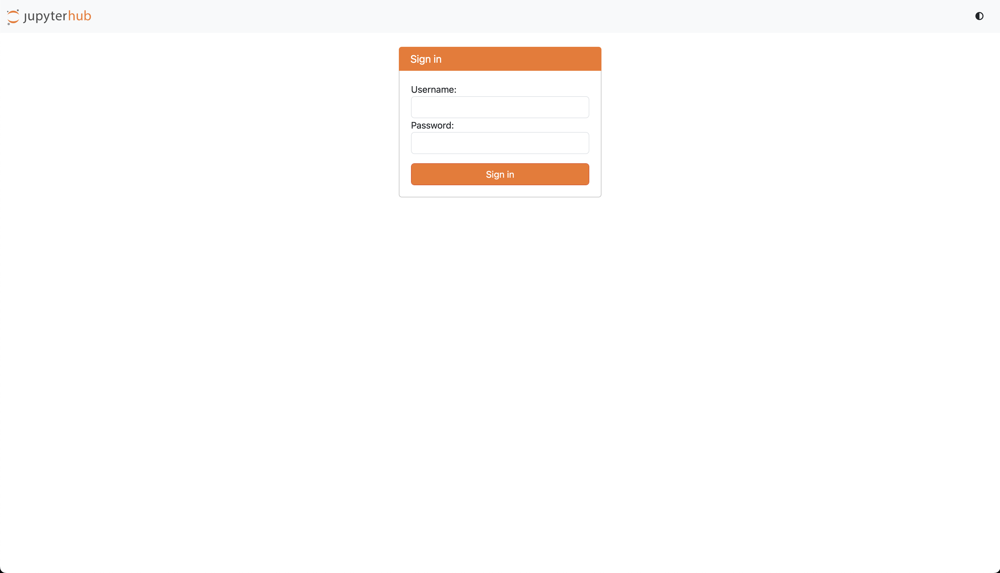
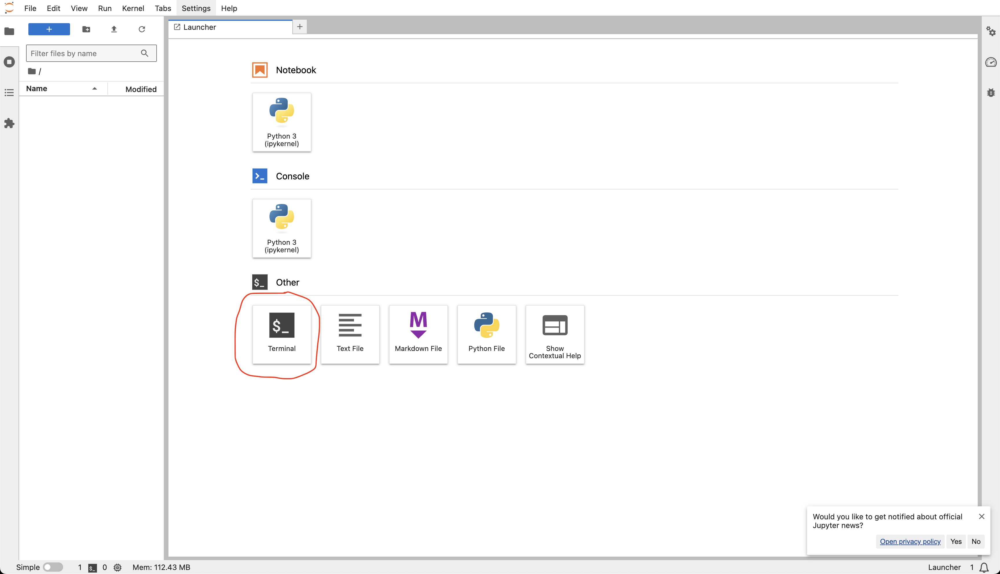
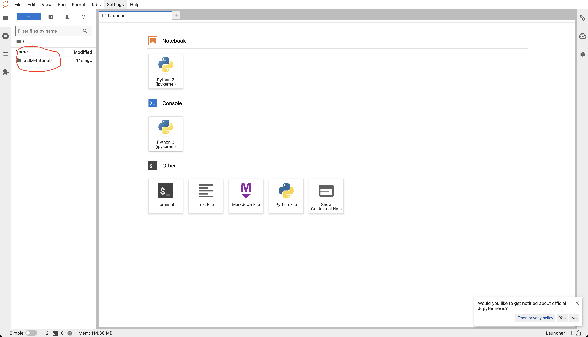
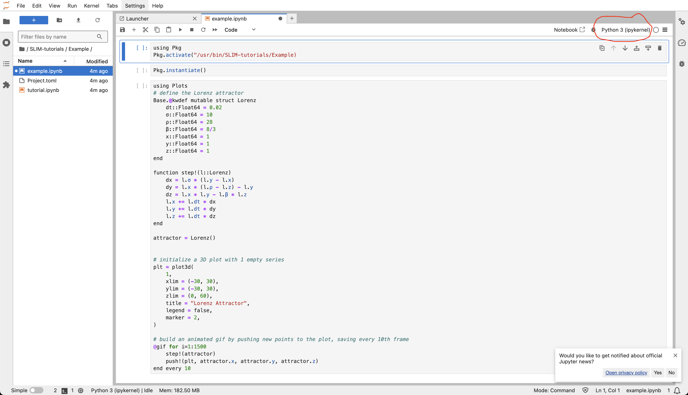
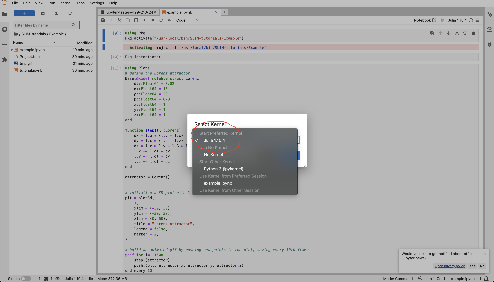

# Seismic Labratory for Imaging and Modeling  

## SLIM-tutorials - ML4Seismic 2024

Partners of ML4Seismic, please follow the below instructions to access the SLIM Lab tutorials. 

The tutorial sessions are scheduled to be held on Friday Nov 15. The entire meeting schedule can be found [here](https://slim.gatech.edu/content/ml4seismic-partners-meeting-2024)

1. Navigate to our server at [`https://slim-tutorials.org/`](https://slim-tutorials.org/)
2. Log in with your provided username and create a password on your first login



3. Open a terminal 



4. Copy and paste the below commands into the terminal:

```
git clone https://github.com/turquoisedragon2926/SLIM-tutorials.git

julia -e 'using Pkg; Pkg.add("IJulia");'
```

4. Access the required notebook using the directory navigator on the left panel



5. Select the current kernel on the top right



5. Select julia to be your active kernel from the list



6. Follow along with the speaker and enjoy!

If you do not have access to a username or have any trouble following the instructions, please talk to a SLIM lab associate.
